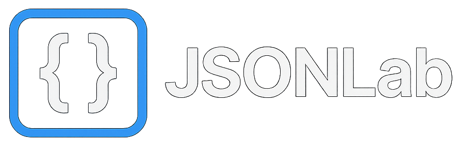

# JSONLab

A powerful, modern tool for viewing, editing, analyzing, and manipulating JSON documents with an intuitive interface and advanced features.



## ✨ Features

### 📄 Document Management
- **File Upload & Editing**: Load JSON files and edit them with Monaco Editor integration
- **Version History**: Track up to 50 versions with timestamps and labels
- **Session Persistence**: Automatically save and restore your work using localStorage
- **Compare Documents**: Side-by-side diff view with version history, file upload, or paste comparison

### 🔍 Analysis & Validation
- **JSON Analysis**: 
  - Detect duplicate keys, circular references, and undefined values
  - Calculate document statistics (depth, key count, arrays, objects)
  - Identify large arrays and strings
  - Check for empty objects and arrays
  - Validate data consistency
- **Schema Generation**: Generate TypeScript, C#, Python, Java, Go, Kotlin, or JSON Schema from your data using Quicktype

### 🔄 Format & Transform
- **Format Options**:
  - Minify, prettify, or compact JSON
  - Configurable spacing (2-space, 4-space, tab)
- **Key Transformations**:
  - Case conversion: camelCase, PascalCase, snake_case, kebab-case, UPPER_CASE
  - Find & replace with regex support
  - Add prefix/suffix to keys
- **Data Conversion**:
  - Export to XML, CSV, YAML, or TOML formats
  - Smart CSV flattening for nested objects

### 🗂️ Data Manipulation
- **Array Manager**: 
  - Sort, filter, and deduplicate arrays
  - Add, edit, or remove array items
  - Support for primitive and object arrays
- **Object Editor**:
  - Add, edit, or delete properties
  - Type-aware editing (string, number, boolean, null, array, object)
  - Nested object support
- **Query Tool**: 
  - JSONPath query support with syntax validation
  - Query history tracking
  - Result highlighting in the document viewer

### 📊 Visualization
- **Graph View**: 
  - Visual representation of JSON structure using ReactFlow
  - Hierarchical layouts (Top-to-Bottom or Left-to-Right)
  - Interactive node exploration
  - Export graph as PNG image
  - Node details panel

### 🎨 User Experience
- **Dark/Light Theme**: Toggle between dark and light modes
- **Resizable Panels**: Customize your workspace layout
- **Filter Controls**: Quick filtering and search in arrays
- **Syntax Highlighting**: Monaco Editor with JSON language support

## 🚀 Getting Started

### Prerequisites
- Node.js (v18 or higher recommended)
- npm or yarn package manager

### Installation

```bash
# Clone the repository
git clone https://github.com/yourusername/JSONLab.git

# Navigate to the project directory
cd JSONLab

# Install dependencies
npm install
```

### Development

```bash
# Start the development server
npm run dev
```

The application will be available at `http://localhost:3000` (or another port if configured).

### Build

```bash
# Build for production
npm run build

# Preview production build
npm run preview
```

### Lint

```bash
# Run ESLint
npm run lint
```

## 🛠️ Tech Stack

- **Frontend Framework**: React 18 with TypeScript
- **Build Tool**: Vite
- **Editor**: Monaco Editor (VS Code's editor)
- **Graph Visualization**: ReactFlow with Dagre layout
- **Data Processing**:
  - JSONPath queries via `jsonpath-plus`
  - Schema generation via `quicktype-core`
  - YAML support via `js-yaml`
  - CSV parsing via `papaparse`
  - TOML support via `smol-toml`
  - XML conversion via `xml-js`
- **Styling**: CSS Modules
- **Image Export**: `html-to-image`

## 📁 Project Structure

```
JSONLab/
├── src/
│   ├── components/          # React components
│   │   ├── AnalyzeView.tsx     # JSON analysis and validation
│   │   ├── ArrayManager.tsx    # Array manipulation
│   │   ├── CompareView.tsx     # Document comparison
│   │   ├── ConvertView.tsx     # Format conversion
│   │   ├── DocumentViewer.tsx  # Main document viewer
│   │   ├── FileUploader.tsx    # File upload interface
│   │   ├── FilterControls.tsx  # Array filtering
│   │   ├── FormatView.tsx      # JSON formatting
│   │   ├── GraphView.tsx       # Graph visualization
│   │   ├── ObjectEditor.tsx    # Object editing
│   │   ├── PropertyEditor.tsx  # Property manipulation
│   │   ├── QueryTool.tsx       # JSONPath queries
│   │   ├── ResizablePanels.tsx # Panel layout
│   │   └── SchemaView.tsx      # Schema generation
│   ├── contexts/            # React contexts
│   │   └── ThemeContext.tsx    # Theme management
│   ├── types/               # TypeScript type definitions
│   │   └── index.ts
│   ├── utils/               # Utility functions
│   │   ├── graphUtils.ts       # Graph conversion logic
│   │   └── jsonUtils.ts        # JSON utilities
│   ├── assets/              # Static assets
│   ├── App.tsx              # Main application component
│   ├── App.css              # Application styles
│   └── main.tsx             # Application entry point
├── index.html               # HTML template
├── package.json             # Project dependencies
├── tsconfig.json            # TypeScript configuration
├── vite.config.ts           # Vite configuration
└── README.md                # This file
```

## 🎯 Use Cases

- **API Development**: Test and validate JSON API responses
- **Data Analysis**: Explore and understand complex JSON structures
- **Schema Generation**: Create type definitions for your data
- **Data Migration**: Convert between JSON and other formats
- **Code Generation**: Generate strongly-typed models from JSON
- **Debugging**: Compare JSON versions and track changes
- **Data Cleaning**: Find and fix issues in JSON data
- **Documentation**: Visualize data structures for documentation

## 🤝 Contributing

Contributions are welcome! Please feel free to submit a Pull Request.

## 📝 License

This project is open source and available under the [MIT License](LICENSE).

## 🐛 Known Issues

- Session storage may fail for very large JSON documents (>4MB)
- Graph visualization performance may degrade with deeply nested structures (>1000 nodes)

## 💡 Tips

- Use **Ctrl+S** (or Cmd+S) in the Monaco Editor to quickly save changes
- Press **Ctrl+F** in the editor to search within your JSON
- Use the **Query Tool** with JSONPath expressions like `$.store.book[*].author` to find specific data
- Enable **version history** to easily track and revert changes
- The **Graph View** is great for understanding complex nested structures at a glance
- Use **Compare** to spot differences between API responses or configuration versions

## 🔮 Future Enhancements

Potential features for future releases:
- Import from URLs
- JSON merge and patch operations
- Custom validation rules
- Bulk operations on arrays
- Export version history
- Collaborative editing
- Browser extension

---

Built with ❤️ using React, TypeScript, and Vite
