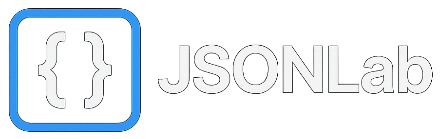

# JSONLab

A powerful, modern tool for viewing, editing, analyzing, and manipulating JSON documents with an intuitive interface and advanced features. Available as both a web application and a native desktop app with CORS-free API access!



## 🚀 Quick Start

### Desktop App (Recommended)
Download the portable `.exe` from the [Releases](https://github.com/bleichroeder/JSONLab/releases) page and run - no installation required! The desktop version includes:
- ✅ **No CORS restrictions** - import from any API
- ✅ **Native performance** - faster than browser version
- ✅ **Offline capable** - works without internet


## ✨ Features

### 🌐 API Integration (NEW!)
- **Import from APIs**: Built-in HTTP client with full REST support
  - All HTTP methods: GET, POST, PUT, PATCH, DELETE, HEAD, OPTIONS
  - Authentication: Bearer Token, Basic Auth, API Key
  - Custom headers with enable/disable toggles
  - Request body editor for POST/PUT/PATCH
  - Response viewer with syntax highlighting
  - URL history (last 10) and saved requests
  - Auto-refresh for monitoring endpoints
  - **Desktop app: No CORS restrictions!**

### 📄 Document Management
- **File Upload & Editing**: Load JSON files and edit them with Monaco Editor integration
- **Version History**: Track up to 50 versions with timestamps and labels
- **Session Persistence**: Automatically save and restore your work using localStorage
- **Compare Documents**: Side-by-side diff view with version history, file upload, or paste comparison
- **Merge Documents** (NEW!): Merge two JSON documents with 5 strategies:
  - Deep merge (recursive)
  - Overwrite (incoming wins)
  - Keep base (base wins)
  - Array concatenation
  - Array unique merge
  - Conflict detection and resolution UI

### 🔍 Analysis & Validation
- **JSON Analysis**: 
  - Detect duplicate keys, circular references, and undefined values
  - Calculate document statistics (depth, key count, arrays, objects)
  - Identify large arrays and strings
  - Check for empty objects and arrays
  - Validate data consistency
- **Schema Generation**: Generate TypeScript, C#, Python, Java, Go, Kotlin, or JSON Schema from your data using Quicktype
- **JSONPath Queries** (Enhanced!):
  - Text and visual query builder modes
  - Autocomplete for property paths and values
  - Syntax validation with helpful error messages
  - Query history tracking
  - Result highlighting in document viewer

### 🔄 Format & Transform
- **Format Options**:
  - Minify, prettify, or compact JSON
  - Configurable spacing (2-space, 4-space, tab)
- **Key Transformations**:
  - Case conversion: camelCase, PascalCase, snake_case, kebab-case, UPPER_CASE
  - Find & replace with regex support
  - Add prefix/suffix to keys
- **Data Conversion**:
  - Export to XML, CSV, YAML, or TOML formats
  - Smart CSV flattening for nested objects

### 🗂️ Data Manipulation
- **Array Manager**: 
  - Sort, filter, and deduplicate arrays
  - Add, edit, or remove array items
  - Support for primitive and object arrays
- **Object Editor**:
  - Add, edit, or delete properties
  - Type-aware editing (string, number, boolean, null, array, object)
  - Nested object support

### 📊 Visualization
- **Graph View**: 
  - Visual representation of JSON structure using ReactFlow
  - Hierarchical layouts (Top-to-Bottom or Left-to-Right)
  - Interactive node exploration
  - Export graph as PNG image
  - Node details panel

### 🎨 User Experience
- **Dark/Light Theme**: Toggle between dark and light modes
- **Resizable Panels**: Customize your workspace layout
- **Filter Controls**: Quick filtering and search in arrays
- **Syntax Highlighting**: Monaco Editor with JSON language support

## 🛠️ Development Setup

### Prerequisites
- Node.js (v18 or higher recommended)
- npm or yarn package manager

### Installation

```bash
# Clone the repository
git clone https://github.com/bleichroeder/JSONLab.git

# Navigate to the project directory
cd JSONLab

# Install dependencies
npm install
```

### Development

#### Web App Development
```bash
# Start the Vite dev server
npm run dev
```
The application will be available at `http://localhost:5173`

#### Desktop App Development
```bash
# Start Electron in development mode with hot reload
npm run electron:dev
```
Opens the app in a native window with DevTools enabled

### Building for Production

#### Web App
```bash
# Build optimized web app
npm run build

# Preview production build
npm run preview
```
Output: `dist/` folder ready for deployment

#### Desktop App

##### Windows
```bash
# Build Windows installer + portable executable
npm run electron:build:win
```
Output:
- `release/JSONLab 1.0.0.exe` - **Portable** (single file, no installation)
- `release/JSONLab Setup 1.0.0.exe` - Installer with Start Menu integration

##### macOS
```bash
# Build macOS disk image and zip
npm run electron:build:mac
```
Output:
- `release/JSONLab-1.0.0.dmg` - Disk image installer
- `release/JSONLab-1.0.0-mac.zip` - Portable zip

##### Linux
```bash
# Build Linux AppImage and deb package
npm run electron:build:linux
```
Output:
- `release/JSONLab-1.0.0.AppImage` - Portable AppImage
- `release/jsonlab_1.0.0_amd64.deb` - Debian package

##### All Platforms
```bash
# Build for all platforms
npm run electron:build
```

### Distribution Notes

**Desktop App Benefits:**
- No CORS restrictions - import from any API
- Native performance and offline capability
- Self-contained - all dependencies included
- File size: ~200-300 MB (includes Chromium + Node.js)

**Code Signing:**
- Executables are currently unsigned (Windows SmartScreen warning)
- For production: Purchase code signing certificate (~$100-400/year)
- Or: Users can bypass by clicking "More info" → "Run anyway"

### Lint

```bash
# Run ESLint
npm run lint
```

## 🛠️ Tech Stack

- **Frontend Framework**: React 18 with TypeScript
- **Build Tools**: 
  - Vite 5 (web app)
  - Electron 39 (desktop app)
  - electron-builder (packaging)
- **Editor**: Monaco Editor (VS Code's editor)
- **Graph Visualization**: ReactFlow with Dagre layout
- **HTTP Client**: 
  - Fetch API (browser)
  - Node.js http/https (Electron - CORS-free!)
- **Data Processing**:
  - JSONPath queries via `jsonpath-plus`
  - Schema generation via `quicktype-core`
  - YAML support via `js-yaml`
  - CSV parsing via `papaparse`
  - TOML support via `smol-toml`
  - XML conversion via `xml-js`
- **Styling**: CSS Modules with custom properties
- **Image Export**: `html-to-image`

## 📁 Project Structure

```
JSONLab/
├── electron/                # Electron main process
│   ├── main.cjs                # Main process entry point
│   └── preload.cjs             # Preload script (IPC bridge)
├── src/
│   ├── components/          # React components
│   │   ├── AnalyzeView.tsx     # JSON analysis and validation
│   │   ├── ApiImportView.tsx   # API import tool (NEW!)
│   │   ├── ArrayManager.tsx    # Array manipulation
│   │   ├── CompareView.tsx     # Document comparison
│   │   ├── ConvertView.tsx     # Format conversion
│   │   ├── DocumentViewer.tsx  # Main document viewer
│   │   ├── FileUploader.tsx    # File upload interface
│   │   ├── FilterControls.tsx  # Array filtering
│   │   ├── FormatView.tsx      # JSON formatting
│   │   ├── GraphView.tsx       # Graph visualization
│   │   ├── MergeView.tsx       # JSON merge tool (NEW!)
│   │   ├── ObjectEditor.tsx    # Object editing
│   │   ├── PropertyEditor.tsx  # Property manipulation
│   │   ├── QueryTool.tsx       # JSONPath queries (Enhanced!)
│   │   ├── ResizablePanels.tsx # Panel layout
│   │   └── SchemaView.tsx      # Schema generation
│   ├── contexts/            # React contexts
│   │   └── ThemeContext.tsx    # Theme management
│   ├── types/               # TypeScript type definitions
│   │   ├── index.ts
│   │   └── electron.d.ts       # Electron API types (NEW!)
│   ├── utils/               # Utility functions
│   │   ├── graphUtils.ts       # Graph conversion logic
│   │   └── jsonUtils.ts        # JSON utilities
│   ├── assets/              # Static assets
│   ├── App.tsx              # Main application component
│   ├── App.css              # Application styles
│   └── main.tsx             # Application entry point
├── release/                 # Build output (gitignored)
├── index.html               # HTML template
├── package.json             # Project dependencies
├── tsconfig.json            # TypeScript configuration
├── vite.config.ts           # Vite configuration
└── README.md                # This file
```

## 🎯 Use Cases

- **API Development & Testing**: Import from REST APIs, test endpoints, monitor responses
- **Data Analysis**: Explore and understand complex JSON structures
- **API Integration**: Save and reuse API requests with authentication
- **Schema Generation**: Create type definitions for your data
- **Data Migration**: Convert between JSON and other formats
- **Code Generation**: Generate strongly-typed models from JSON
- **Debugging**: Compare JSON versions, track changes, merge configurations
- **Data Cleaning**: Find and fix issues in JSON data
- **Documentation**: Visualize data structures for documentation
- **Configuration Management**: Merge and compare config files

## 🤝 Contributing

Contributions are welcome! Please feel free to submit a Pull Request.

### Development Workflow
1. Fork the repository
2. Create a feature branch (`git checkout -b feature/amazing-feature`)
3. Make your changes
4. Test both web and desktop versions
5. Commit your changes (`git commit -m 'Add amazing feature'`)
6. Push to the branch (`git push origin feature/amazing-feature`)
7. Open a Pull Request

## 📝 License

This project is open source and available under the [MIT License](LICENSE).

## 📦 Deployment

### Web App
Deploy the `dist/` folder to any static hosting service:
- **GitHub Pages**: Use GitHub Actions workflow
- **Vercel**: Connect repository for automatic deployments
- **Netlify**: Drag and drop `dist/` folder or connect repo
- **AWS S3 + CloudFront**: Upload to S3 bucket

### Desktop App
1. Build executables with `npm run electron:build:win` (or mac/linux)
2. Upload to GitHub Releases
3. Users download and run - no server needed!

## 🙏 Acknowledgments

- Built with [React](https://react.dev/) and [TypeScript](https://www.typescriptlang.org/)
- Powered by [Vite](https://vitejs.dev/) and [Electron](https://www.electronjs.org/)
- Editor by [Monaco Editor](https://microsoft.github.io/monaco-editor/)
- Graph visualization by [ReactFlow](https://reactflow.dev/)
- Schema generation by [Quicktype](https://quicktype.io/)

## 🐛 Known Issues

- Session storage may fail for very large JSON documents (>4MB)
- Graph visualization performance may degrade with deeply nested structures (>1000 nodes)
- Web version: CORS restrictions apply when importing from APIs (use desktop app for CORS-free access)
- Windows SmartScreen may show warning for unsigned executables (click "More info" → "Run anyway")

## 💡 Tips

- Use **Ctrl+S** (or Cmd+S) in the Monaco Editor to quickly save changes
- Press **Ctrl+F** in the editor to search within your JSON
- Use the **Query Tool** with JSONPath expressions like `$.store.book[*].author` to find specific data
- Try the **visual query builder** for easier JSONPath construction with autocomplete
- Enable **version history** to easily track and revert changes
- The **Graph View** is great for understanding complex nested structures at a glance
- Use **Compare** to spot differences between API responses or configuration versions
- **Save API requests** in the API Import tool for quick access to frequently used endpoints
- Use **auto-refresh** in API Import to monitor live endpoints
- The **Merge tool** supports 5 strategies - experiment to find the right one for your use case
- **Desktop app tip**: No CORS restrictions - import from any API without proxy or configuration

## 🔮 Future Enhancements

Potential features for future releases:
- Custom validation rules and schemas
- Bulk operations on arrays
- Export version history
- Collaborative editing
- Browser extension
- GraphQL support in API tool
- JSON Patch (RFC 6902) support
- Custom merge strategies
- Workspace management (multiple documents)

---

Built with ❤️ using React, TypeScript, and Vite
